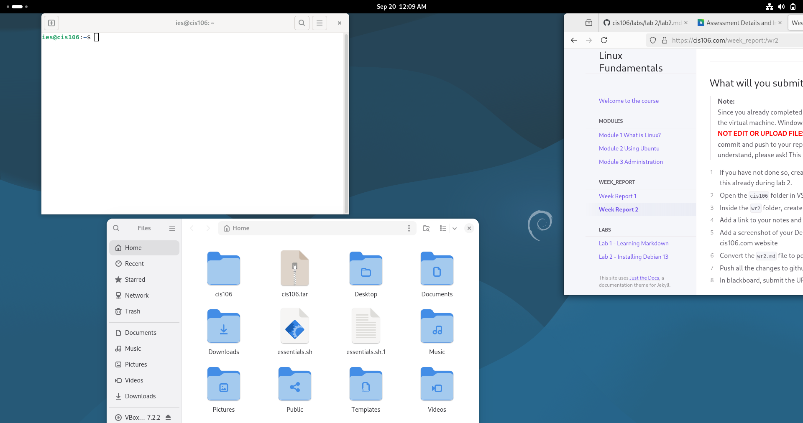

# week report 2

## ALternative 1 using the local file path
- [notes 2](../../notes/notes2/notes2.md)
- [lab 2](../../labs/lab%202/lab2.md)

## Alternative 2 using the github url
- [notes 2](https://github.com/Iansuero/cis106/blob/main/notes/notes2/notes2.md)
- [lab 2](https://github.com/Iansuero/cis106/blob/main/labs/lab%202/lab2.md)

## debian Desktop

